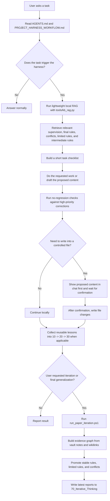

# Self-Learning Library

Self-Learning Library is a local-first self-learning knowledge-base harness for Codex-style AI work. It turns repeated corrections, writing rules, workflow lessons, and project memories into a layered vault that an AI assistant can retrieve before a task and improve after a task.

> Instead of asking your AI to remember everything, make it retrieve the right rule, avoid past regressions, and promote repeated lessons into stable knowledge.

The included vault is exported from a real manuscript-assistance workflow, but the mechanism is domain-independent. You can reuse the same structure for coding habits, research notes, product work, lab workflows, prompt engineering, legal drafting, personal SOPs, or any knowledge process that should improve over time.

## What It Does

Self-Learning Library gives an AI assistant a small local operating loop:

```text
Retrieve relevant memory -> Apply rules -> Check no-regression -> Record lesson -> Promote stable rules
```

It combines:

- a layered Obsidian-compatible Markdown vault;
- lightweight local retrieval with `tools/kb_rag.py`;
- graph-style iteration and rule promotion with `tools/paper_iteration.py`;
- a root harness workflow in `PROJECT_HARNESS_WORKFLOW.md`;
- Codex-facing instructions in `AGENTS.md`;
- a PowerShell entrypoint for full iteration.

## Why This Exists

LLM chats often:

- forget project-specific constraints;
- repeat mistakes that were already corrected;
- mix old preferences with newer ones;
- over-load context with irrelevant history;
- produce rules that are not grounded in concrete evidence;
- fail to distinguish stable rules from limited or conflicting rules.

This harness makes the useful parts of past work explicit, searchable, and promotable.

## Before and After

| Without the harness | With Self-Learning Library |
| --- | --- |
| The assistant repeats solved mistakes. | High-priority corrections become no-regression guards. |
| Old chat context is hard to reuse. | Reusable lessons become file-backed memories and rules. |
| Every task loads too much background. | Lightweight RAG retrieves only a few relevant notes. |
| Rules are mixed with evidence and opinions. | The vault separates evidence, reasoning, stable rules, limited rules, and conflicts. |
| Knowledge improves only inside one conversation. | Repeated lessons can be promoted into long-term rules. |

## Knowledge Layers

| Layer | Path | Purpose |
| --- | --- | --- |
| Index | `00_Index.md` | Entry point for the vault |
| Change log | `10_Project_Change_Log/` | Concrete changes made during real work |
| Memories | `20_Paper_Memories/` | Reusable lessons, user preferences, corrections, and baselines |
| Intermediate rules | `30_Writing_Rules/` | Rules extracted from memory but not always final |
| Workflow governance | `35_Workflow_Governance/` | Rules about how the harness itself should behave |
| Final rules | `40_Final_Generalized_Rules/` | Stable rules that are safe to reuse |
| Supervision | `45_Supervision/` | High-priority corrections and no-regression constraints |
| Conflicts | `50_Conflicts/` | Contradictions that need human judgment |
| Limited rules | `60_Limited_Rules/` | Useful rules that are scoped or not yet general |
| Iterative thinking | `70_Iterative_Thinking/` | Generated reports, graph summaries, and latest conclusions |

The folder names still say `paper` because this repository was extracted from a writing project. The reusable part is the layered learning pattern.

## Thinking Flow



## Quick Start

Clone the repository:

```powershell
git clone https://github.com/LLK-LL/Self-Learning-Library.git
cd Self-Learning-Library
```

On Windows, enable Git long paths before cloning and prefer a short local path such as `C:\dev\Self-Learning-Library`. The included Obsidian vault contains descriptive note filenames that can exceed the legacy Windows path limit when the repository is nested deeply.

```powershell
git config --global core.longpaths true
```

Install Python 3.10 or newer. The included scripts use the Python standard library.

Run lightweight retrieval for an ordinary task:

```powershell
py tools\kb_rag.py --query "revise introduction with mentor feedback" --limit 3
```

Run workflow/governance retrieval only when the task is about process:

```powershell
py tools\kb_rag.py --query "how should the system apply rules before a task" --include-workflow
```

Run a full iteration when you explicitly want screening, final generalization, or a complete rule refresh:

```powershell
powershell -NoProfile -ExecutionPolicy Bypass -File .\run_paper_iteration.ps1
```

The latest reports appear in:

```text
paper_writing_obsidian_vault/70_Iterative_Thinking/
```

## Chat Commands

Use these with a Codex-style assistant in this repository:

```text
Use the local harness and revise this paragraph.
```

```text
Search the self-learning knowledge base first, then answer.
```

```text
Use lightweight RAG with limit 3 before revising this content.
```

```text
Record this correction as a reusable rule.
```

```text
Run a self-iteration and tell me what rules became stable, limited, or conflicting.
```

```text
Before writing into the document, show me the proposed replacement text in chat.
```

## Examples

- [Build a domain-specific vault](examples/domain-vault-adaptation.md)
- [Use lightweight retrieval before a task](examples/lightweight-rag.md)
- [Run a full rule iteration](examples/full-iteration.md)
- [No-regression guard pattern](examples/no-regression-guard.md)

## Repository Layout

```text
.
├── AGENTS.md
├── PROJECT_HARNESS_WORKFLOW.md
├── run_paper_iteration.ps1
├── tools/
│   ├── kb_rag.py
│   └── paper_iteration.py
└── paper_writing_obsidian_vault/
    ├── 00_Index.md
    ├── 10_Project_Change_Log/
    ├── 20_Paper_Memories/
    ├── 30_Writing_Rules/
    ├── 35_Workflow_Governance/
    ├── 40_Final_Generalized_Rules/
    ├── 45_Supervision/
    ├── 50_Conflicts/
    ├── 60_Limited_Rules/
    └── 70_Iterative_Thinking/
```

## Adapt It To Your Own Domain

To use this outside paper writing, replace or rewrite notes under:

- `10_Project_Change_Log/`: concrete task history;
- `20_Paper_Memories/`: reusable memories;
- `30_Writing_Rules/`: intermediate rules;
- `40_Final_Generalized_Rules/`: stable rules;
- `45_Supervision/`: high-priority corrections.

You can keep the current vault name or rename it and update constants in:

- `tools/kb_rag.py`
- `tools/paper_iteration.py`
- `PROJECT_HARNESS_WORKFLOW.md`

## Safety Notes

- Do not upload private documents, unpublished manuscripts, credentials, raw chat logs, or personal data unless you intend them to be public.
- Keep workflow rules separate from content rules.
- Treat final generalized rules as stable only when supported by evidence notes.
- Keep unresolved contradictions in `50_Conflicts/` instead of forcing a false rule.
- Review the included vault before using it as a public template.

See [Security and publishing](docs/security-and-publishing.md).

## Project Status

Self-Learning Library is an extracted working prototype. The current scripts are intentionally simple and local-first. They use Markdown files, JSON reports, wikilinks, and Python standard-library parsing instead of a server or database.

## Roadmap

- Add a clean demo vault with synthetic examples.
- Add macOS/Linux convenience scripts.
- Add tests for retrieval ranking and rule promotion.
- Add templates for coding, research, product, and lab-work domains.
- Add a short demo GIF or screenshot walkthrough.

## Contributing

Contributions are welcome when they keep the project local-first, inspectable, and evidence-grounded. Good contributions include new domain templates, safer publishing guidance, retrieval improvements, tests, and clear workflow examples.

See [CONTRIBUTING.md](CONTRIBUTING.md).

## One-Sentence Summary

**Self-Learning Library is a local self-learning knowledge-base harness that helps AI assistants retrieve relevant rules, avoid repeated mistakes, and promote repeated lessons into stable reusable knowledge.**
