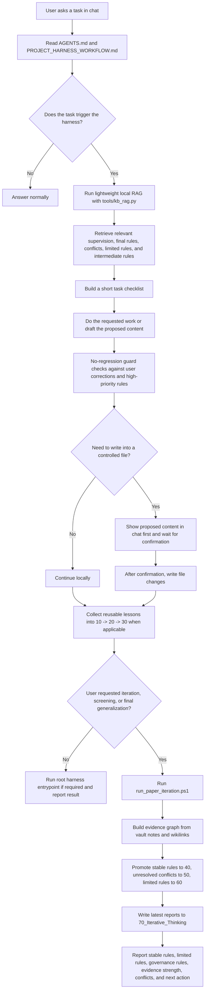

# Self-Learning Library

Self-Learning Library is a local self-learning knowledge-base harness for Codex-style AI work.

It is not a normal note folder. It is a small operating system for reusable knowledge: the AI records useful experience, retrieves the right rules before a task, checks whether a new answer regresses against past corrections, detects conflicts, and periodically turns repeated lessons into stable rules.

The included vault is an example exported from a real manuscript-assistance project, but the mechanism is domain-independent. You can use the same structure for coding habits, research notes, product work, lab workflows, prompt engineering, legal drafting, personal SOPs, or any other knowledge that should improve over time.

## What Problem It Solves

Large language model chats forget details, mix old and new preferences, and repeat solved mistakes. This harness makes the useful parts of past work explicit:

- `10_Project_Change_Log`: what changed in real work.
- `20_Paper_Memories`: reusable lessons, user preferences, corrections, and successful baselines.
- `30_Writing_Rules`: intermediate rules extracted from memory.
- `35_Workflow_Governance`: process rules for how the harness itself should behave.
- `40_Final_Generalized_Rules`: stable rules that are safe to reuse.
- `45_Supervision`: high-priority corrections and no-regression constraints.
- `50_Conflicts`: unresolved contradictions that need human judgment.
- `60_Limited_Rules`: useful but not-yet-general rules.
- `70_Iterative_Thinking`: generated iteration reports, graph summaries, and latest conclusions.

The folder names still say `paper` because this repository was extracted from a writing project. The same layers can be reused for any subject by changing the note content and, if desired, renaming the vault and constants in the scripts.

## Core Idea

The system separates knowledge into layers:

- Evidence layer: concrete memories and change logs.
- Reasoning layer: rules, conflicts, limits, and workflow governance.
- Output layer: generated iteration reports and summaries.

During a chat task, the assistant should not load everything. It first uses lightweight local retrieval to find the few relevant rules. For final iteration, it reads the broader evidence graph and decides which lessons are stable, which are limited, and which conflict.

## Current Thinking Flow



## Repository Layout

```text
.
├── AGENTS.md
├── PROJECT_HARNESS_WORKFLOW.md
├── run_paper_iteration.ps1
├── tools/
│   ├── kb_rag.py
│   └── paper_iteration.py
└── paper_writing_obsidian_vault/
    ├── 00_Index.md
    ├── 10_Project_Change_Log/
    ├── 20_Paper_Memories/
    ├── 30_Writing_Rules/
    ├── 35_Workflow_Governance/
    ├── 40_Final_Generalized_Rules/
    ├── 45_Supervision/
    ├── 50_Conflicts/
    ├── 60_Limited_Rules/
    └── 70_Iterative_Thinking/
```

## How To Configure

1. Clone the repository.

```powershell
git clone https://github.com/LLK-LL/Self-Learning-Library.git
cd Self-Learning-Library
```

2. Install Python 3.10 or newer.

No third-party Python packages are required for the included scripts.

3. Keep the root files visible to your AI coding/chat agent.

The important files are:

- `AGENTS.md`: tells the agent when and how to use the harness.
- `PROJECT_HARNESS_WORKFLOW.md`: defines the workflow, retrieval order, rule priority, no-regression guard, and collection process.
- `run_paper_iteration.ps1`: root entrypoint for full iteration.
- `tools/kb_rag.py`: lightweight local rule retrieval.
- `tools/paper_iteration.py`: full graph-based iteration and rule promotion.

4. Optional: rename the vault for your domain.

The current vault name is:

```text
paper_writing_obsidian_vault
```

For another domain, you can either keep the name and replace the notes, or rename it and update the vault constants in:

```text
tools/kb_rag.py
tools/paper_iteration.py
PROJECT_HARNESS_WORKFLOW.md
```

5. Run a local retrieval test.

```powershell
py tools\kb_rag.py --query "how should the system apply rules before a task" --include-workflow
```

6. Run a full iteration.

```powershell
powershell -NoProfile -ExecutionPolicy Bypass -File .\run_paper_iteration.ps1
```

The latest output appears in:

```text
paper_writing_obsidian_vault/70_Iterative_Thinking/
```

## How To Use It In Chat

Put this repository in the workspace used by your AI assistant. Then ask normally, but make your intent explicit when you want memory or iteration.

Useful chat commands:

```text
Use the local harness and revise this paragraph.
```

```text
Search the self-learning knowledge base first, then answer.
```

```text
Record this correction as a reusable rule.
```

```text
Run a self-iteration and tell me what rules became stable, limited, or conflicting.
```

```text
Before writing into the document, show me the proposed replacement text in chat.
```

```text
Use the no-regression guard before finalizing this change.
```

## Recommended Agent Behavior

When a task triggers the harness, the assistant should:

1. Retrieve relevant rules with `tools/kb_rag.py`.
2. Convert retrieved rules into a short checklist.
3. Do the requested work.
4. Check for regressions against high-priority corrections.
5. Collect reusable process into `10 -> 20 -> 30` when applicable.
6. Run `run_paper_iteration.ps1` when the user asks for iteration, screening, or final generalization.
7. Report what changed and what remains unresolved.

## What To Replace For Your Own Domain

To adapt this repository, replace or rewrite notes under:

- `10_Project_Change_Log`: your concrete task history.
- `20_Paper_Memories`: your reusable memories.
- `30_Writing_Rules`: intermediate rules.
- `40_Final_Generalized_Rules`: stable rules.
- `45_Supervision`: high-priority corrections.

The harness does not require the knowledge to be about papers. The layer design is the reusable part.

## Safety Notes

- Do not upload private documents, unpublished manuscripts, credentials, or raw chat logs unless you intend them to be public.
- Keep workflow rules separate from content rules. A rule about how the system should check work should not be inserted into the output content.
- Treat final generalized rules as stable only when they are supported by evidence notes.
- Keep unresolved contradictions in `50_Conflicts` instead of forcing a false rule.

## Project Status

This repository is an extracted working prototype. The current scripts are intentionally simple and local-first. They use Markdown files, JSON reports, wikilinks, and Python standard-library parsing instead of a server or database.
