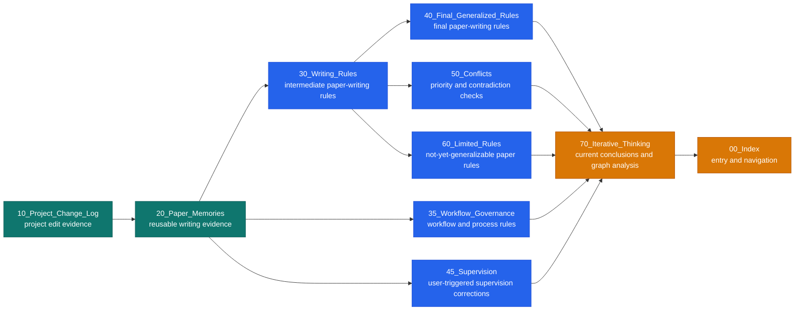

---
title: Layered graph overview
tags:
  - layer/output
  - paper-iteration
  - vault-graph
---

# Layered Graph Overview

## Layer Flow

## Layer Counts

- Evidence: `144` notes
- Reasoning: `30` notes
- Output: `7` notes

## Obsidian Graph Filters

- All layers: `tag:#layer/evidence OR tag:#layer/reasoning OR tag:#layer/output`
- Evidence only: `tag:#layer/evidence`
- Evidence and reasoning: `tag:#layer/evidence OR tag:#layer/reasoning`
- Hide output layer: `tag:#layer/evidence OR tag:#layer/reasoning`

## Rule

Only the Evidence Graph contributes to conclusion support scores. Reasoning and output layers are shown for navigation and audit.
